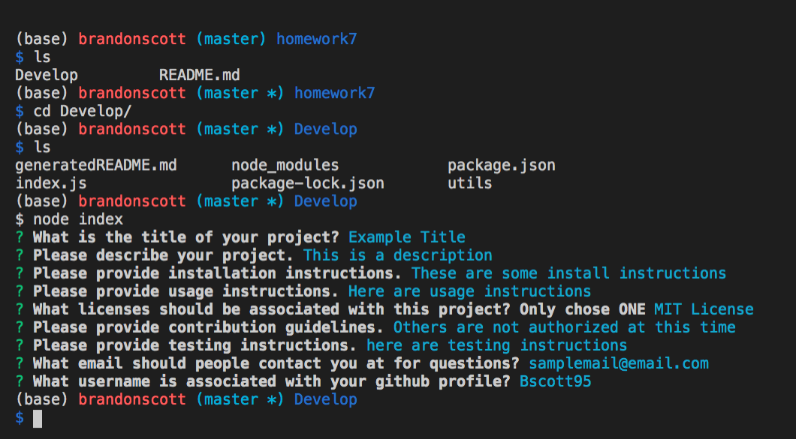

# README Generator
Created a command-line application that dynamically generates a README.md from a user's input. The application can be invoked with the following command:

```sh
node index.js
```

The user will be prompted for their GitHub username, which will be used to make a call to the GitHub API to retrieve their email and profile image. They will then be prompted with questions about their project.

The README will be populated with the following:

* At least one badge
* Project title
* Description
* Table of Contents
* Installation
* Usage
* License
* Contributing
* Tests
* Questions
* User GitHub profile picture
* User GitHub email


## Business Context

When creating an open source project on GitHub, it is important to have a quality README with information about the app--what is the app for, how to use the app, how to install it, how to report issues, and how to make contributions so that other developers are more likely to use and contribute to the success of the project. A command-line application will allow for quick and easy generation of a project README to get started quickly. This will allow a project creator to spend more time working on finishing the project and less time creating a good README.

## Links
Repo: https://github.com/Bscott95/homework7
Generated README is in utils folder
